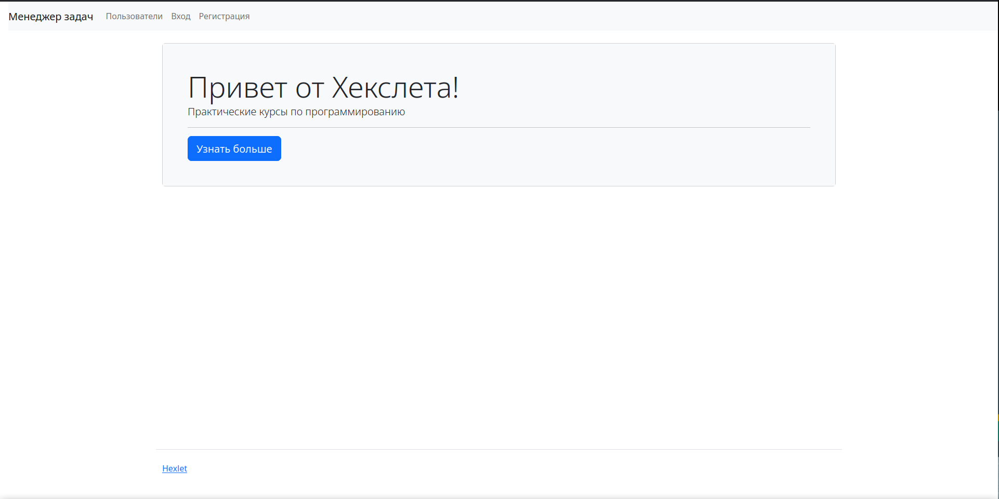
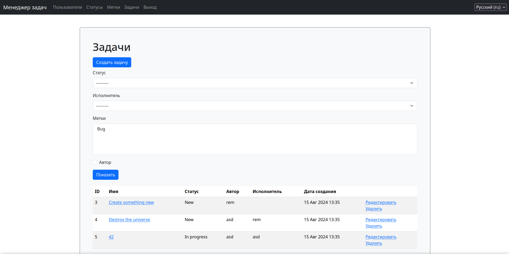

# Менеджер задач

[](https://github.com/remortalite/python-project-52/actions)
[](https://github.com/remortalite/python-project-52/actions/workflows/build.yml)

Учебный проект. Основной функционал -- позволить пользователям зарегистрироваться и управлять задачами.
Приложение даёт возможность зарегистрированным пользователям создавать, изменять и удалять задачи,
а также связанные с ними элементы. Также проект поддерживает ведение статусов задач и создание меток.

## Установка и запуск

Управление проектом описано в [Makefile](./Makefile).

Для запуска необходим набор переменных окружения, описанных в [.env.example](./.env.example). 
Переменные должны быть прописаны в файле `.env` в корне проекта.

Установка приложения:
```bash
make build
make install
```

Development версия проекта развертывается следующими командами:
```bash
make build
make install-dev
make dev # запускает сервер на локальном хосте
```

## Пример работы:




